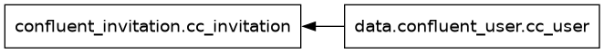

# Local auth users

Local user account management using terraform.



Provisions:

- User account invitations
- (User accounts)

## Notes

There is currently no user account resource in our terraform provider. The best options to manage users by configuring SSO with automatic group mappings.
To manage local user creation with terraform use the invitation resource together with the user data object.check.
 
 
Considerations:
- Use for_each to manage users through a variable list
- Enable allow_delection on invitations so that entries can be removed again
- Remove users from the list only when:
  - invitation is still pending and you want to remove it
  - the user has been deleted through the UI


If the invitation is deleted after the user has accepted it, a subsequent creation of an invitation will result in "409 Conflict: This user already exists within the Organization"


## Setup

```sh
terraform init

cat > terraform.tfvars <<EOF
confluent_cloud_api_key = "{Cloud API Key}"
confluent_cloud_api_secret = "{Cloud API Key Secret}"
use_prefix = "{Your resource prefix}"
EOF
```