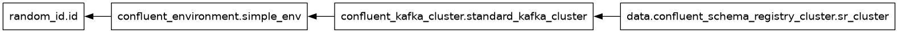

# Simple org setup

Basic environment and cluster creation.



Provisions:

- Environment
- Kafka Cluster (Basic)
- Schema Registry (Essentials)


## Setup

```sh
terraform init

cat > terraform.tfvars <<EOF
confluent_cloud_api_key = "{Cloud API Key}"
confluent_cloud_api_secret = "{Cloud API Key Secret}"
use_prefix = "{Your resource prefix}"
EOF
```